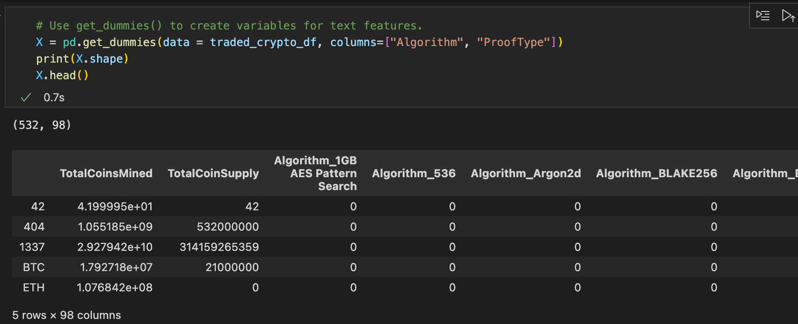
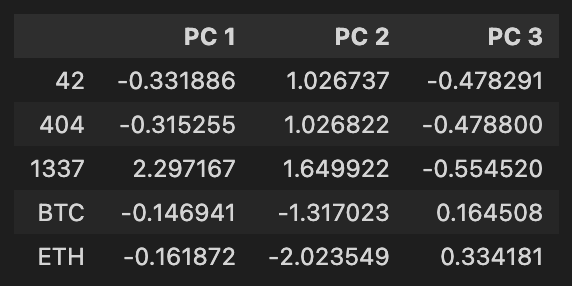
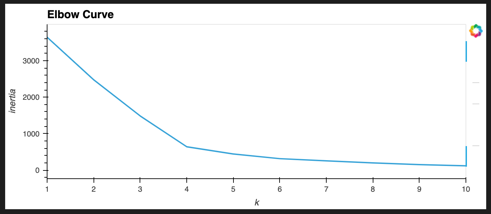
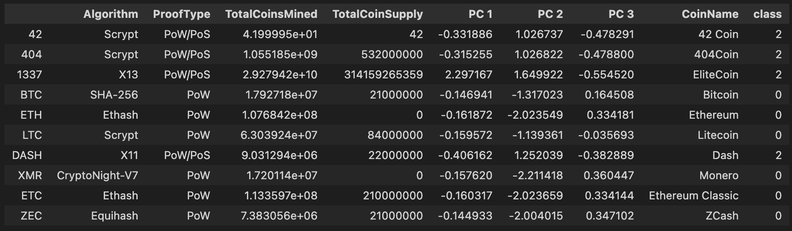
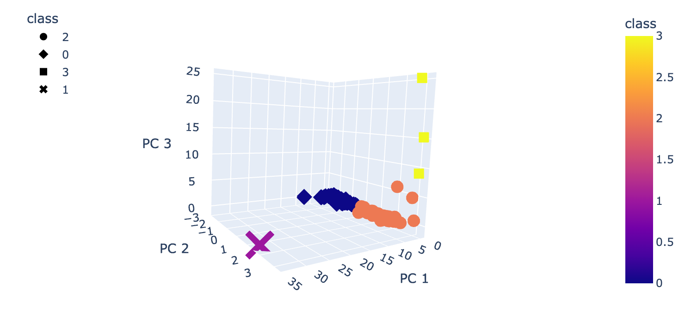
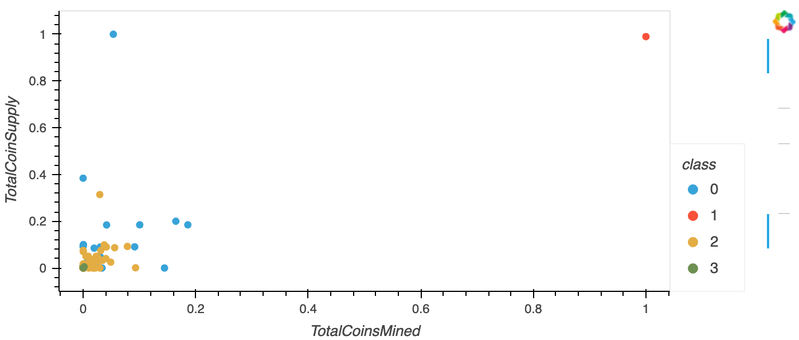

# Overview

This report shows what cryptocurrencies are on the trading market and how they could be grouped to create a classification system. The data to create the report was processed to fit the machine learning models. Since there is no known output for what the report is looking for, it relies on unsupervised learning. To group cryptocurrencies, a clustering algorithm was used. Lastly, data visualizations were created with Plotly to show findings in the report.

# Process

## Preprocessing the data for PCA

1. In order to perform PCA, the data was preprocessed using Pandas. The following steps were taken:

- Removed cryptocurrencies that are not being traded.
- Removed rows that have at least one null value.
- Removed rows where coins have not been mined.

2. A new DataFrame that holds only the crytpocurrency names was created, keeping the same index as the original dataframe.
3. In the original dataframe, the CoinName was removed since it was not going to be used ont he clustering algorithm.
4. The get_dummies() method was used to create variables for two text features in the dataframe. The resulting data was stored in a new DataFrame named X.
5. The StandardScaler fit_transform() function was used to standardixe the features from the X dataFrame.

## Reducing Data Dimensions Using PCA

The dimensions of the X dataFrame were reduced to 3 principal components using the Principal Component Analysis algorithm (PCA). These dimensions were then placed in a new dataframe.

## Clustering Cryptocurrencies Using K-means

An Elbow curve was created to find the best value for K from the PCA dataframe. The K-means algorithm was then run to predict the K clusters for the cryptocurrencies' data.

# Results

### 3D scatter plot of the 3 Clusters

### Mined vs Supplied Coins Scatter plot

